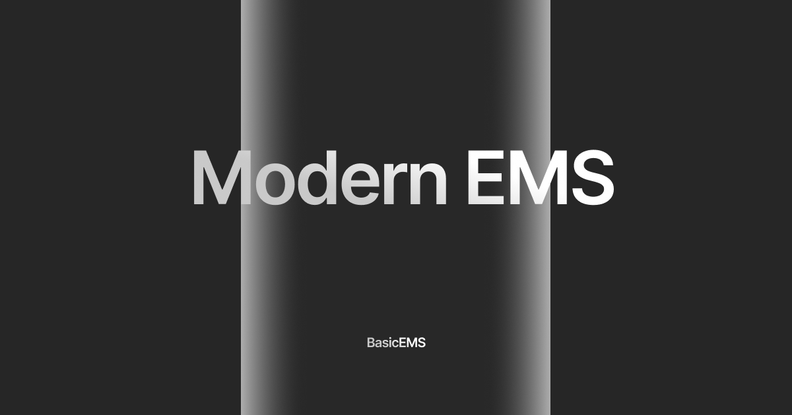

# BasicEMS



BasicEMS is a lightweight employee management system built for very small businesses (barber shops, kiosks, small retail) and tiny teams. It focuses on simple employee records and task tracking without enterprise features.

WARNING: This platform is intentionally scoped for really small businesses or personal use. It is not designed for large organizations, multi-department workflows, or high-volume operational needs.

## What it does

- Employee directory with contact info, department, job title, and work times.
- Task management with status, due date, and employee assignment.
- Search across employees and tasks.
- Authentication with Fortify, including optional two-factor settings.
- Per-user ownership with policies to keep data scoped to the signed-in user.

## Tech stack

- Laravel 12
- Livewire 4 + Flux UI
- Tailwind CSS 4
- Fortify (auth)

## Requirements

- PHP 8.2+
- Composer
- Node.js and npm
- A database supported by Laravel (SQLite, MySQL, etc.)

## Setup

### Windows

```cmd
composer install
copy .env.example .env
php artisan key:generate
php artisan migrate
npm install
npm run build
```

### Linux

```bash
composer install
cp .env.example .env
php artisan key:generate
php artisan migrate
npm install
npm run build
```

### macOS

```bash
composer install
cp .env.example .env
php artisan key:generate
php artisan migrate
npm install
npm run build
```

## Run the app

If you use Laravel Herd on macOS or Windows, it will serve the app automatically.

Optional (manual dev server):

```bash
composer run dev
```

This starts the Laravel server, queue listener, and Vite dev server together.

## Seed demo data (optional)

```bash
php artisan db:seed
```

This creates a test user (`test@example.com`) and seeds employees and tasks.

## Notes

- Employee and task pages require a verified account.
- Settings include profile, password, appearance, and two-factor options.
- Task statuses: `pending`, `in_progress`, `completed`.

## Tests

```bash
php artisan test --compact
```
